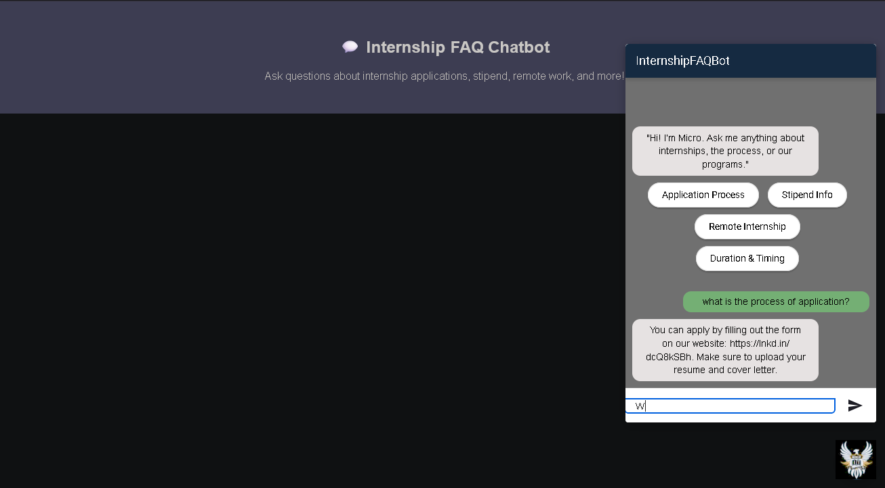

# Internship FAQ Chatbot – Micro IT Services

This is an AI-powered FAQ chatbot built using **Dialogflow**, designed to help answer common questions related to internships at Micro IT Services.

## 🔍 Features

- Instant answers to:
  - How to apply for internships?
  - Is the internship paid?
  - Duration of the internship?
  - Company overview
  - Working hours
  - Fallback response for unrecognized questions
  - Voice input support
  - Clean HTML interface with Dialogflow Web Demo integration

## 💬 Live Chatbot Demo

👉 [Click to Try the Chatbot](https://bot.dialogflow.com/ae28ee9c-6ae6-43d7-a2a3-498f89bc1c52)

## 🧑‍💻 How to Run Locally

1. Clone or download the repository.
2. Open the folder in VS Code.
3. Install required Python packages (Flask):
```bash
pip install flask
4. Run the Flask app:
python app.py
5. Open your browser and go to: http://127.0.0.1:5000

   *(Or use Python to run a local server.)*
```bash
python -m http.server 8000

Then open http://localhost:8000

## 📸 Screenshot




🛠️ Built With

   * Flask – Lightweight Python web framework to serve chatbot UI

   * Dialogflow ES – Natural Language Understanding

   * HTML, CSS, JavaScript – Frontend interface

   * Dialogflow Web Demo – Integrated into web page

📬 Contact

Built by Bhooma Anand as part of an AI/ML Internship Project at Micro IT Services.
